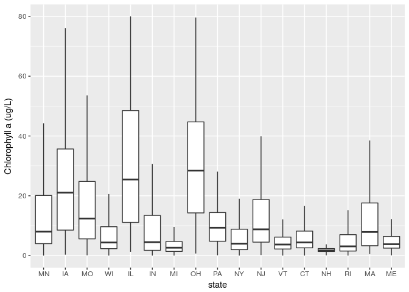
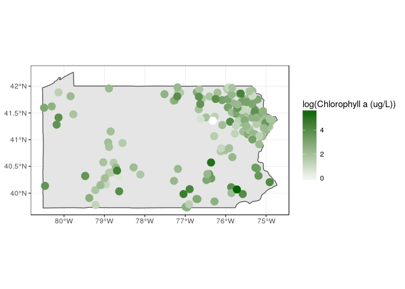

<%@meta language="R-vignette" content="-------------------------------- 
DIRECTIVES FOR R: 

  %VignetteIndexEntry{Working with LAGOS} 
  %VignetteAuthor{Joseph Stachelek} 
  %VignetteEngine{R.rsp::rsp} 
--------------------------------------------------------------------"%>
The following document presents two analyses to demonstrate use of the
`LAGOS` package.

To begin, we load LAGOS data with `lagos_load`:

    library(LAGOS)

    ## Welcome to LAGOS version 1.087.1. To cite LAGOS in publications use: 
    ##  
    ## Soranno, P.A., Bissell, E.G., Cheruvelil, K.S., Christel, S.T., Collins,
    ##     S.M., Fergus, C.E., Filstrup, C.T., Lapierre, J.F., Lottig, N.R., Oliver,
    ##     S.K., Scott, C.E., Smith, N.J., Stopyak, S., Yuan, S., Bremigan, M.T.,
    ##     Downing, J.A., Gries, C., Henry, E.H., Skaff, N.K., Stanley, E.H.,
    ##     Stow, C.A., Tan, P.N., Wagner, T. and Webster, K.E. 2015. Building a
    ##     multi-scaled geospatial temporal ecology database from disparate data
    ##     sources: fostering open science and data reuse. Gigascience, 4(1)

    dt <- lagos_load("1.087.1")

Boxplot of average chlorophyll by state
---------------------------------------

The first analysis involves contructing a boxplot of average lake
chlorophyll by state. To begin, we join the nutrient water quality table
(`epi.nutr`) to the location information for each lake in the `locus`
table. Next, we join the output to the `state` table to obtain state
abbreviations that correspond to each lake. Finally, we filter the
dataset to exclude any lakes that do not fall within a state.

    library(dplyr)
    library(ggplot2)

    lg <- left_join(dt$epi_nutr, dt$locus)
    lg <- left_join(lg, dt$state)
    lg <- group_by(lg, state)
    lg <- filter(lg, !is.na(state))

Now, the `levels` of the `state` factor column are in alphabetical order
by default. We need to reorder the factor levels from East to West in
preparation for plotting.

    levels(lg$state)

    ##  [1] "CT" "IA" "IL" "IN" "MA" "ME" "MI" "MN" "MO" "NH" "NJ" "NY" "OH" "PA"
    ## [15] "RI" "VT" "WI"

    state_easting <- summarize(lg, 
                        mean_easting = mean(nhd_long, na.rm = TRUE))
    state_easting <- arrange(state_easting, mean_easting)

    lg$state <- factor(lg$state, levels = state_easting$state)

Finally, we contruct a boxplot with `ggplot`:

    ggplot(lg) + 
      geom_boxplot(aes(x = state, y = chla), outlier.shape = NA) + 
      ylim(c(0, 80)) + ylab("Chlorophyll a (ug/L)")

Map of average chlorophyll in Pennsylvania
------------------------------------------

The second analysis involves contructing a map of average lake
chlorophyll concentration in Pennsylvania lakes. To begin, we use the
`maps` and `sf` package to obtain a geographic outline of the state.

    library(maps)
    library(sf)

    states <- st_as_sf(map("state", plot = FALSE, fill = TRUE))
    pa <- filter(states, ID == "pennsylvania")

Next, we filter the output from the previous analysis to only include PA
lakes and calculate mean chlorophyll for each lake:

    pa_chl <- filter(lg, state == "PA")
    pa_chl <- group_by(pa_chl, lagoslakeid)
    pa_chl <- summarize(pa_chl, 
                          mean_chl  = mean(chla, na.rm = TRUE), 
                          mean_long = mean(nhd_long, na.rm = TRUE), 
                          mean_lat  = mean(nhd_lat, na.rm = TRUE))
    pa_chl <- filter(pa_chl, !is.na(mean_chl))

Finally, we turn our `data.frame` into an sf geospatial object using
`st_as_sf` before constructing a map with `ggplot` and `geom_sf`.

    pa_chl <- st_as_sf(pa_chl, coords = c("mean_long", "mean_lat"), crs = 4326)

    ggplot() + 
      geom_sf(data = pa) +
      geom_sf(data = pa_chl, aes(color = log(mean_chl))) + 
      theme_bw() + scale_color_gradient(low = "white", high = "darkgreen") +
      labs(color = "log(Chlorophyll a (ug/L))")

